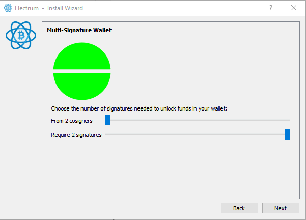
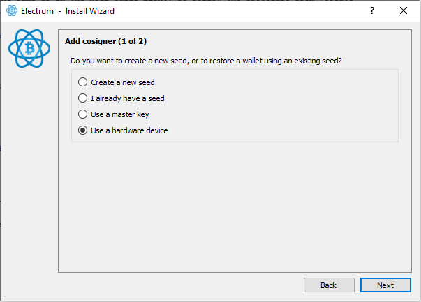
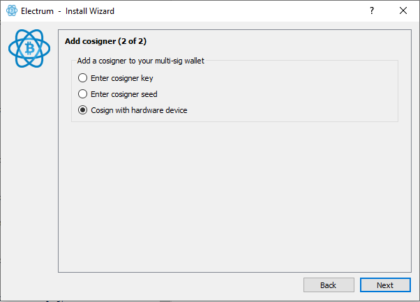

[ **Guide** ] -- [ [Bonus](https://github.com/HelgeHunding/guides/blob/master/hodl-guide/hodl-guide_60_bonus.md) ]

---

# The Hodl Guide Light, Multi Sig

---

#### *This is a draft, all feedback is appreciated!*

This is a guide for anyone who wants to start taking control of their bitcoin holdings. Maybe you want to improve your cold storage even more by creating a multi signature wallet. This is an excellent next step if you've followed [Hodl Guide Light](https://github.com/HelgeHunding/guides/blob/master/hodl-guide-light/README.md) or if you have some experience with hardware wallets.

This is a guide for cold storage and not for a wallet used for “day to day spending”.

After you’ve completed this guide, you’ll have a secure storage solution that doesn't rely on one hardware wallet manufacturers wallet. You can later upgrade this setup to an even more complex multi-sig with the full [Hodl Guide](https://github.com/HelgeHunding/guides/blob/master/hodl-guide/README.md).

As always with Bitcoin, I or no one else can be responsible for your bitcoin. You have to trust and hold yourself responsible for everything.

## Requirements

* Two hardware wallets from different manufacturers (Ledger, Trezor,Coldcard etc).
* One internet connected computer.
* Paper of good quality to write your secret seed on (usually included with the hardware wallet).

I have experience with Trezor One and Ledger Nano S, so the guide will follow the procedure on those wallets. But you can of course use another hardware wallet if you like it and trust the manufacturer. You can use an existing hardware wallet if you have one. We are going to create a new wallet in Electrum that won't be linked to your previous wallets. So you don't have to worry about previous privacy leaks.

Electrum supports most popular hardware wallets on the market.

Hardware wallets are great. But their main focus is security, not privacy. We do not know what the future might bring. For example, how governments will treat bitcoin. You won't get much privacy if you use the hardware wallet "out of the box" with the manufacturers wallet. The setup in this guide will give you the possibility to improve your privacy.
Privacy isn’t black or white, it’s a scale. Your privacy can be breached in many ways and every individual leak can be combined to reduce your privacy. We’ll try to avoid some of the worst mistakes.

## Setup

The procedure for setting up the hardware wallet is the same as in the Hodl Guide Light. So follow the procedure from [Create the secret seed with your hardware wallet](https://github.com/HelgeHunding/guides/blob/master/hodl-guide-light/README.md#create-the-secret-seed-with-your-hardware-wallet) until you are redirected back to this guide before the wallet creation in Electrum. The only difference is that you'll end up with two passphrases and two seeds. Write those down on two different notes. Call the first passphrase, `Passphrase A` and the second `Passphrase B` (we will attach them to wallets later). Mark the first secret seed `A` and the second secret seed `B` and remember which hardware wallet they belong to.

## Create the wallet

You can now create a new wallet. If you have a wallet open, go to File>New/Restore. Otherwise the installer should be launched automatically. 

Pick a name for the wallet and click Next:

Select "Multi-signature wallet" and click Next:

Let the sliders remain at 2 cosigner with 2 signatures needed, click Next:

Change to "Use a hardware device". Insert your first hardware wallet. This will be `hardware wallet A`. Make sure to use the hardware wallet with the seed you marked `A`. If you use a Ledger Nano S, unlock it with the "secret PIN" that contains your passphrase. Then click next. If using a Trezor, simply connect it and click next:

Your hardware wallet should be detected (otherwise rescan by clicking Next), click Next: 

If you use a Trezor, enter the PIN and the passphrase when asked for it.

On the next screen, you can let "Native Segwit Multisig (p2wsh)" be selected. This is a newer type of address that'll give you lower fees. Click Next:

Note: Some services are slow to update and can't send directly to native segwit addresses. Most should update soon and you can always use an intermediate wallet (like a normal Electrum wallet) if you can't send directly.

The next window shows your Master Public Key. We don't need this now as you are both cosigner 1 and 2 (you can always access this later in Electrum). Click Next:

We are now adding cosigner 2. Insert the second hardware wallet (you can keep both wallets inserted to the computer, just make sure to select the right one at the next step). If you use a Ledger Nano S, unlock it with the "secret PIN" that contains your passphrase. Then click next. If using a Trezor, simply connect it and click next:

Your hardware wallet should be detected (otherwise rescan by clicking Next), select the right wallet and click Next: 

Let "Native Segwit Multisig" be selected and click Next:

Your wallet is now created and you should be asked for a password to encrypt your wallet. This is for your master public keys that’s stored on your computer and it’s a good idea to protect those with a password. Pick a strong password, preferably generated by a password-manager. You will need this password to open the wallet in Electrum (but not for restoring your funds, you can always restore your funds with your seeds + the seed passwords). You can store this password in LastPass, Keepass or similar managers or use a password you'll remember. Enter the password, confirm it and click Next:

Your wallet is now created and you should see the following screen:

Before depositing any larger amounts, do at least one test deposit and withdrawal to make sure everything is working. Deposit funds by going to the "receive" tab and copy the address. You can confirm the address on one (or both) of your hardware wallets (click on the eye in the address field) if you want extra security. Withdraw funds by going to the "send" tab. Enter the information, make sure your first hardware wallet is connected (you can connect both at the same time if you like). Click "Send" and confirm everything on your first hardware wallet (this process can sometimes be slow). Connect your second hardware wallet (you can remove the first if you like, the transaction is signed with that key) and repeat the process.

## Store secret information

You now have to decide how to store everything. 

You should have the following:

* Hardware wallet A (containing your first secret seed, accessed with a PIN-code).
* Hardware wallet B (containing your second secret seed, accessed with a PIN-code).
* Passphrase A and B in a password manager or a secure note.
* A note with your first secret 24 word seed (Seed A).
* A second note with your second secret 24 word seed (Seed B).
* A note with passphrase A on it.
* A second note with passphrase B on it.

How you store this depends on your situation and threat level. As this is a 2 of 2 multi signature wallet you need both seeds and both passphrases to spend any funds. 

So, how you store your funds is a balancing act between accessibility and security. I guess you want to be able to access your funds in case your house burns down. Do you also want your relatives to be able to access the funds in case you are in a coma and needs to pay your hospital bills?

A base case for storage could be this:
* Make sure that you can access your password manager from another place then your home. In that case, you should always have access to your passphrases. That could be by making a copy of your secure note to an USB-flash drive (make sure the note is encrypted) and storing it elsewhere or by using LastPass servers.
* Store both hardware wallets at your home. This way you'll always be able to access your funds from your home.
* Store your first secret seed (Seed A) with someone you trust (or in a bank vault/deposit box that trusted persons gets access to in case of an emergency). This person won't be able to steal your bitcoin or even know what how much you own unless they gets access to the second seed and both of your passphrases. 
* Store your second secret seed (Seed B) with someone else you trust (or in a bank vault/deposit box that trusted persons gets access to in case of an emergency). 
* The passphrases makes this setup fairly flexible. How you store it depends on how much you trust other people.
  * Option 1: Store it together with the seeds. In this case, person 1 and 2 can collaborate to access your funds in case of an emergency. But, they can as well collaborate to steal your funds. This will probably be more secure if you change one of the persons to a bank vault or deposit box.
  * Option 2: Store it at home. You can still access your funds if your house burns down by using the backup seed and the passphrase stored in your secure note. But it's harder for your relatives to access your funds in case of an emergency. They would have to find the notes with your passphrases in your home and figure out that they belong to the secret seeds.
  
I hope that gives you some guidelines!

## Improve your storage

As we said before, you now have the base to improve the privacy of your wallet. Check out these [Electrum best pracitses](https://github.com/HelgeHunding/guides/blob/master/hodl-guide/hodl-guide_67_electrum-bp.md) for a few important points to think about.

