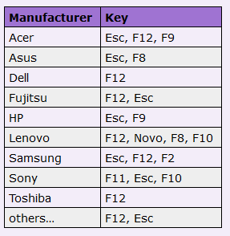
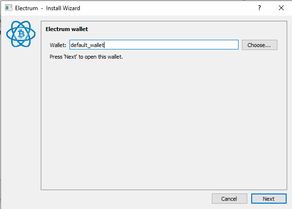
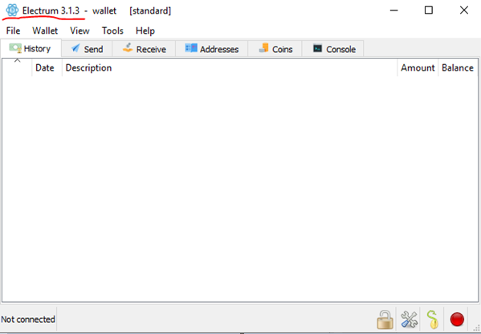

[ [Intro](README.md) ] -- [ [Preparations]( hodl-guide_10_preparations.md) ] -- [ [First Keys](hodl-guide_20_first-keys.md) ] -- [ **Last Key** ] -- [ [Multi-Sig](hodl-guide_40_multi-sig.md) ] -- [ [Key storage](hodl-guide_50_key-storage.md
) ] -- [ [Bonus](hodl-guide_60_bonus.md) ] -- [ [Troubleshooting](hodl-guide_70_troubleshooting.md) ]

---

# Generate the last key with Tails

We are generating the last key with Electrum on a computer booted with Tails, https://tails.boum.org/. Tails is a live operating system that´s built upon Debian (a Unix-like operating system). 
It´s booted from a USB-stick and only uses the computers RAM-memory. That means that all sensitive information is erased when the USB is ejected (and your computer will start with your usual operating system like nothing happened). 

## Download Tails
Go to https://tails.boum.org/install/index.en.html and select your operating system. If you don´t have an old copy of Tails, select “Install from {Your operating system}”. 
Select “Let´s go” and download the USB image at step 1.1 to a directory on your computer. At the download page, make sure to download `tails-signing.key` and `tails-amd64-3.12.1.img.sig` (at the “OpenPGP signature for the Tails 3.12.1 USB image” link, the exact name should change for future versions) and place the files in the same directory as the .img file. 
Wait until the USB image is downloaded.

## Verify signatures

We need to verify what we downloaded (and that´s why we downloaded the last two files). As we are verifying the download ourselves, skip step 1.2 “Verify your download using your browser”. The browser extension is probably fine, but it´s a great practice to do it yourself as the process can be used for other files as well. And browser extensions always comes with a risk of leaking personal information, so always be cautious with browser extensions (no idea if this particular extension does that, probably not). 

It’s the same procedure as before (check the [Preparations](https://github.com/HelgeHunding/guides/blob/master/hodl-guide/hodl-guide_10_preparations.md#first-steps) for more information about validating signatures). 

Start a terminal window (like Powershell on Windows).

Change the current directory to the one where the 3 downloaded files are located, for example: 

`$ cd $HOME/Downloads`

To be able to verify the signature, import the Tails-signing key into your local GPG installation: 

`$ gpg --import tails-signing.key`

Now use the “detached signature” to check that the .img file was signed with the signing key we imported:

`$ gpg --verify tails-amd64-3.12.1.img.sig tails-amd64-3.12.1.img` (make sure to change the file name on both places if using a newer version). The verification can take a while. 

Expected output should be something like:
```
gpg: Signature made 01/28/19 18:44:16 W. Europe Standard Time 
gpg: using RSA key FE029CB4AAD4788E1D7828E8A8B0F4E45B1B50E2 
gpg: Good signature from "Tails developers (offline long-term identity key) <tails@boum.org>" [unknown] 
gpg: aka "Tails developers <tails@boum.org>" [unknown] 
gpg: WARNING: This key is not certified with a trusted signature! 
gpg: There is no indication that the signature belongs to the owner. 
Primary key fingerprint: A490 D0F4 D311 A415 3E2B B7CA DBB8 02B2 58AC D84F 
Subkey fingerprint: FE02 9CB4 AAD4 788E 1D78 28E8 A8B0 F4E4 5B1B 50E2 
```
The important part is the date, `Good signature` and Primary key fingerprint `A490 D0F4 D311 A415 3E2B B7CA DBB8 02B2 58AC D84F` 
This ensures that the .img file was signed with a key with the fingerprint A490 D0F4… at a date, not to long before the release. If we do an online search, one of the first matches was [@Tails_live](https://twitter.com/tails_live) on what seems to be a legit Twitter account and who has the fingerprint in the bio. 

Another match is a post from 2015 on the official webpage that announces a change to this key and we can also see several old posts from Reddit. We can be almost certain (not possible to do more) that this release was indeed signed by the developers. This process would catch a scenario were a malicious actor had taken control over the webpage and uploaded a bad file and a bad signing key. If you get a bad signature or another fingerprint, stop and investigate further before installing anything. 

If everything is good, go ahead and create the boot USB. This is going to be used to create the last private key.  

## Flash Tails to USB

The easiest way is to follow the instructions on https://tails.boum.org/install for your operating system. 

So, insert the USB you are going to use and follow the instructions at “2/5 Install Tails”. In Mars 2019 that means downloading, running and flashing the USB with Etcher for Windows and macOS and with GNOME Disks for Linux. When step 2/5 is completed, you´ve got two choices. 

If you use one computer. Tails is going to be started on the computer you are reading this on. In that case you´re going to have to print or write down the rest of the of the instructions on this page. You could also bring the instructions up on another device (keep them in flight mode and don’t let any cameras see any screens or private keys). Make sure no other USB drives is connected to the computer.

If you are using two computers. Tails is going to be started on the other computer and you can keep the instructions on the main computer. The other computer could be a normal computer that's going to be used for other things after the process. Or for extra security, an eternally quarantined computer. Make sure no other USB drives is connected to the computer.

## Start computer on Tails

Go ahead and make sure that the USB with Tails is inserted in the right computer. Start (or restart) the computer.

If the computer starts on Tails, the ”Boot Loader Menu” should appear:


Tails should be selected and start automatically after a few seconds. If it does, follow the instructions on the screen for starting (setting up language and keyboard) and start Tails. 

Otherwise, restart the computer and bring the boot menu up. The key for bringing the boot menu up differs from manufacturer to manufacturer. 

*On PC*, It´s usually Esc or F12. Usual keys used for the boot menu on different manufacturers:




Choose the USB-stick with Tails in the boot menu. If that doesn´t work, you might have to change settings in Bios (turn off secure start, change start order, disable fast start etc).

Check the troubleshooting guide at the install page at Tails for more information. There could be issues with certain computers or graphic cards, check the troubleshooting guide to see if there´s an easy fix. 

*On Mac*, Immediately press-and-hold the Option key (Alt key) until a list of possible start-up disks appears. 
If the computer starts on Tails, the Boot Loader Menu appears and Tails starts automatically after 4 seconds. 

There could be issues with certain computers or graphic cards, check the troubleshooting guide at the install page to see if there´s an easy fix.

When you get past the boot loader menu, follow the instructions on the screen to start Tails.

## Generating the private key with Electrum

Once started, make sure WiFi is disconnected (arrow in upper right corner, should say “Wi-Fi not connected). 

Go to Applications (upper left corner)>Internet>Electrum Bitcoin Wallet. Click on `Launch` if a window about persistence appears.

The Electrum – Install Wizard should appear. The name of the wallet isn’t important (it will be deleted), so “default_wallet” is ok. Click Next:



On the next step, let “Standard wallet” be selected (we are only interested in generating a key). Click Next:


On the next step, let “Create a new seed” be selected. Click Next:


On the next step, change “Seed type” to Segwit. Segwit is a newer type of address, so services that´s slow to update might have issues sending to these types of addresses. But it should be possible from most services and it´s a more “modern” address that usually works better with multi-sig in Electrum. Click Next:


You should now see 12 words, this is your private key! Electrum use 12 words for it´s seed, most hardware wallets use 24. Today the difference doesn’t really matter, the security is plenty (and we have two other keys with 24 words). Write down the 12 words you see on your screen by hand on a piece of paper of good quality (or on cryptosteel etc). Then click next:


Confirm your seed by typing all the words you wrote down in the blank field. When finished, click Next:


You should see a screen asking for a password. This is for protecting the walletfile and we don’t need that (since everything is deleted once finished), so leave blank and click Next:


Electrum is now generating addresses, it can take a while before the main window shows up. Once the main window loads, the key and all necessary information is now generated!

Before we move on, we need the master public key for our multi-sig contract and check what version of Electrum we are running.

Start with the version. Check what version of Electrum that´s running on Tails. For example, Tails 3.12.1 comes with Electrum 3.1.3. Note this on a piece of paper or on your main computer (not secret information).



Now we only need to copy the master public key. The master public key is used in our multi-sig contract and to derive bitcoin addresses to send funds to. To show the master public key in Electrum, go to `Wallet>Information`. 

We need to copy this to our live system where we´ll construct the multi-signature wallet. But we don’t want to put another USB in to our system at this point (reduce any risk of information about our private key leaking). Your public master key doesn´t really affect your bitcoin’s security (no one can steal your funds with a public key). But all your bitcoin-addresses can be generated from the master public key (in a multi-sig you would need all 3 public keys). So, for privacy, it should be treated with care. But it isn´t as sensitive as a private key. The key can be represented as a QR code. In the bottom right corner, click “Show as QR-code”: 


It´s now safe to bring other electronic devices near the computer that generated the private key. So, you can turn your cell phone on, but put it in flight mode so nothing is uploaded to any cloud service (or use a digital camera). We are going to use several cameras, so double check that no private keys are lying around. With your cell phone, taka a photo of the QR-code that represents the master public key. 

If you use one computer, remove the tails boot USB from the computer and restart the computer on your regular OS (you can keep Tails running if you use two computers). 

---
Next up: [Create the multi-sig wallet >>](hodl-guide_40_multi-sig.md)
