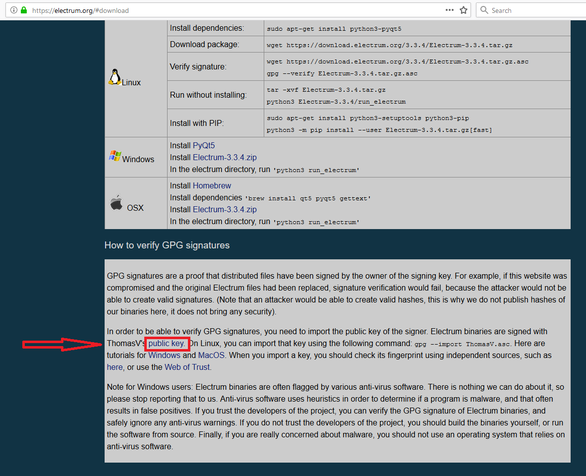
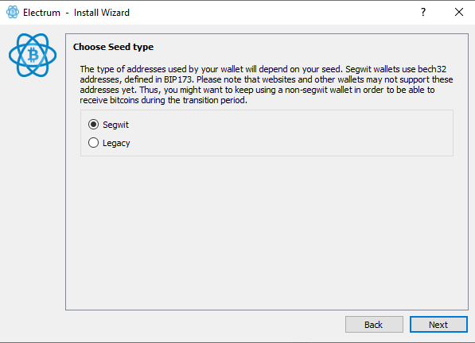
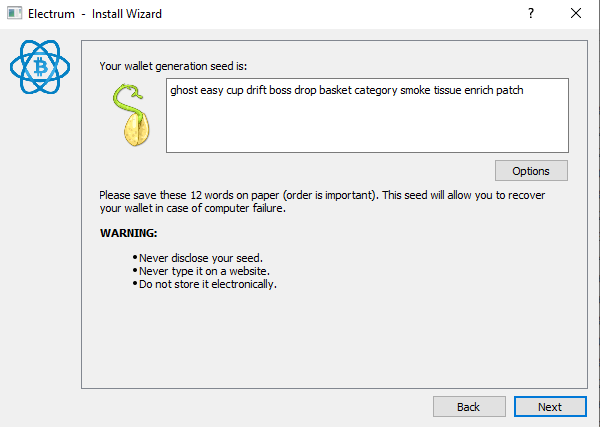
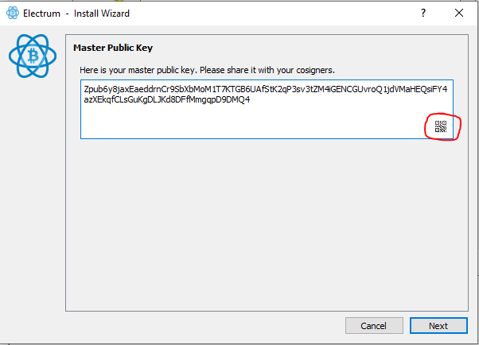
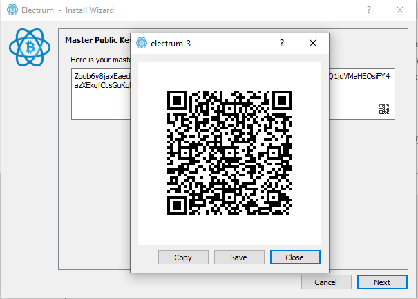

[ [Intro](README.md) ] -- [ [Preparations]( hodl-guide_10_preparations.md) ] -- [ [First Seeds](hodl-guide_20_first-seeds.md) ] -- [ **Last Seed** ] -- [ [Multi-Sig](hodl-guide_40_multi-sig.md) ] -- [ [Storage](hodl-guide_50_storage.md
) ] -- [ [Bonus](hodl-guide_60_bonus.md) ] -- [ [Troubleshooting](hodl-guide_70_troubleshooting.md) ]

---

# Generate the last seed with Tails

You should now have the following:

* `Seed A`
* `Information package A` containing `PIN_A: pin_hw_a`
* `Seed B`
* `Information package B` containing `PFA: your_passphrase_A` and `PIN_B: pin_hw_b`
* `Information package C` containing `PFB: your_passphrase_B`
* `Hardware Wallet A` (containing seed A)  
* `Hardware Wallet B` (containing Seed B)
* `Digital note` containing:

```
PFA: your_passphrase_A
PFB: your_passphrase_B
```

You need to have this at hand to generate the last seed:

* A computer connected to the internet (can be your normal computer).
* 1 USB flash drive with at least 8 GB of memory (USB1).
* 1 other USB flash drive, memory not important (USB2).
* 1 note to write your seed on.
* 1 phone with a camera or a digital camera (don't bring this near the computer until your seed is generated).
* *Optional:* A second computer to run Tails on. This computer can be made eternally quarantined.

We are generating the last seed (seed C) with Electrum on a computer booted with Tails, https://tails.boum.org/. Tails is a live operating system that´s built upon Debian (a Unix-like operating system). 
It´s booted from a USB-stick and only uses the computers RAM-memory. That means that all sensitive information is erased once the USB is removed (and your computer will start with your usual operating system like nothing happened). 

## Download GnuPG for validating digital signatures

An important part of the guide (and a great skill to have) is to know how to validate digital signatures. This is skipped by many (I'm sometimes guilty of it myself). But don't skip it now, it'll take a few minutes to download the software (one time effort) and then a few seconds to verify your downloads. The validation will make sure that the downloaded file was signed by the developers of the project. This'll for example, catch a scenario where the official website was compromised and a malicious file was uploaded or where you went to the wrong website and downloaded a malicious file there.

We are using an implementation of the OpenPGP standard to verify signatures. The implementation varies for different OS:

*Windows:* Download and install the latest version of [Gpg4win](https://www.gpg4win.org). If you don’t want to donate, click bank transfer on the download page to access the download. You only need to install GnuPG and Kleopatra.

*macOS:* Download and install the latest version of [GPG Suite](https://gpgtools.org/)

*Linux:* [GnuPG](https://gnupg.org/) comes pre-installed with Linux distributions.

An easy way to verify a digital signature is to use a terminal (the command line).
In all examples, what´s written to the terminal is everything after the `$` sign (and examples that's specific for Windows uses the symbol `>`).

For example: `$ cd`
Means that you´d write `cd` to the terminal (cd is a command that changes the active directory).
Usually you can paste text to a terminal with ctrl+v or with a right click on the mouse. Another useful shortcut is to use the arrows up and down to toggle between previously executed commands. If you´re stuck, you can usually kill a process with Ctrl+C or Ctrl+Z.

The symbol `~` is used as a shortcut to the home/user folder. It works on Mac, Linux and with PowerShell on Windows. That way you can for example write `~\Downloads` instead of the whole path `C:\Users\User1\Downloads`.

## Download and verify Electrum

Electrum is an open source wallet that has been around for many years. It offers great usability (support for multi-sig, hardware wallets etc) and you can connect it to your Bitcoin Core full node. Tails is shipped with Electrum pre-installed. Unfortunately the version in recent Tail releases isn't compatible with offline signing in newer releases. So, we need use a newer version. If this changes in future releases, the part with upgrading Electrum can be skipped.  

So, we are going to download the latest version of Electrum. Go to https://electrum.org/#download and download the "Appimage" for Linux (this'll be used in Tails). If you are using Windows or macOs download the installers for your operating system as well (if you are using Windows, read the note on the bottom of the download page). For any file you download, download the signature as well (the link is next to the installer).

We need the signing key of Electrum developer Thomas Voegtlin to verify the signatures. Scroll down to the bottom of the page and click on the “Public Key” link (you can skip this on Linux and use gpg --import ThomasV.asc):



That should take you to a page with the public key, use `Ctrl+S` or `Cmd+S`and save the file `ThomasV.asc` on your computer (preferably in the same location as the downloaded installer).

Once downloaded we need to verify the signatures to make sure the developers signed this release.

Open a terminal (for example PowerShell on Windows).

Change the current directory to the one where the 3 downloaded files are located:

`$ cd ~/Downloads`

Import the signing key from ThomasV into your local GPG installation:

`$ gpg --import ThomasV.asc`

Start by verifying the appimage. Use the .asc-file to check that the file was signed with the signing key we imported:

`$ gpg --verify electrum-3.3.4-x86_64.AppImage.asc`

(make sure to change the file name if using a different version).

The verification can take a while.

The output should be something like:

```
gpg: assuming signed data in 'electrum-3.3.4-x86_64.AppImage'
gpg: Signature made 02/13/19 23:08:30 W. Europe Standard Time
gpg:                using RSA key 6694D8DE7BE8EE5631BED9502BD5824B7F9470E6
gpg: Good signature from "ThomasV <thomasv1@gmx.de>" [unknown]
gpg: WARNING: This key is not certified with a trusted signature!
gpg:          There is no indication that the signature belongs to the owner.
Primary key fingerprint: 6694 D8DE 7BE8 EE56 31BE  D950 2BD5 824B 7F94 70E6
```

The signing was made the same day as the release was uploaded (should be around the same time), you can see the dates [Here](https://download.electrum.org/).

It´s a `Good signature`.

A search online on `6694 D8DE 7BE8 EE56 31BE D950 2BD5 824B 7F94 70E6` seems to confirm that this key belongs to Thomas V. We are getting results from different sources that would be hard to fake. If you get a bad signature or another fingerprint, stop and investigate further before installing anything.

If you are using Windows or macOs, go ahead and verify that file as well. For example on Windows:

`$ gpg --verify electrum-3.3.4-setup.exe.asc`

The output should be almost the same, for example:

```
gpg: assuming signed data in 'electrum-3.3.4-setup.exe'
gpg: Signature made 02/13/19 23:08:30 W. Europe Standard Time
gpg:                using RSA key 6694D8DE7BE8EE5631BED9502BD5824B7F9470E6
gpg: Good signature from "ThomasV <thomasv1@gmx.de>" [unknown]
gpg: WARNING: This key is not certified with a trusted signature!
gpg:          There is no indication that the signature belongs to the owner.
Primary key fingerprint: 6694 D8DE 7BE8 EE56 31BE  D950 2BD5 824B 7F94 70E6
```

Insert USB2 in the computer and copy the appimage to the USB. Eject the USB once the file is copied.

We are leaving Electrum for now and can rest assure that we have a legit version.

## Download Tails

Next step is to install Tails. Go to [the install page](https://tails.boum.org/install/index.en.html) and select your operating system. If you don´t have an old copy of Tails, select “Install from {Your operating system}”.
Select “Let´s go” and download the USB image at step 1.1 to a directory on your computer. At the download page, make sure to download `tails-signing.key` and the detached signature `tails-amd64-3.XX.XX.img.sig` (at the “OpenPGP signature for the Tails 3.XX.X USB image” link. Place the files in the same directory as the .img file. Wait until the USB image is downloaded.

## Verify signatures

We need to verify what we've downloaded (and that´s why we downloaded the last two files). As we are verifying the download ourselves, skip step 1.2 “Verify your download using your browser”. The browser extension is probably fine, but it´s a great practice to do it yourself as the process can be used for other files as well.

It’s the same procedure as before.

Open a terminal window (like PowerShell on Windows).

Change the current directory to the one where the 3 downloaded files are located, for example:

`$ cd ~/Downloads`

To be able to verify the signature, import the Tails-signing key into your local GPG installation:

`$ gpg --import tails-signing.key`

Now use the “detached signature” to check that the .img file was signed with the signing key we imported. If you used version 3.12.1:

`$ gpg --verify tails-amd64-3.12.1.img.sig` (change the file name if using a newer version). The verification can take a while.

Expected output should be something like:

```
gpg: Signature made 01/28/19 18:44:16 W. Europe Standard Time 
gpg: using RSA key FE029CB4AAD4788E1D7828E8A8B0F4E45B1B50E2 
gpg: Good signature from "Tails developers (offline long-term identity key) <tails@boum.org>" [unknown] 
gpg: aka "Tails developers <tails@boum.org>" [unknown] 
gpg: WARNING: This key is not certified with a trusted signature! 
gpg: There is no indication that the signature belongs to the owner. 
Primary key fingerprint: A490 D0F4 D311 A415 3E2B B7CA DBB8 02B2 58AC D84F 
Subkey fingerprint: FE02 9CB4 AAD4 788E 1D78 28E8 A8B0 F4E4 5B1B 50E2 
```

The important part is the date, `Good signature` and Primary key fingerprint `A490 D0F4 D311 A415 3E2B B7CA DBB8 02B2 58AC D84F` 
This ensures that the .img file was signed with a key with the fingerprint A490 D0F4… at a date, not to long before the release. If we do an online search, one of the first matches was [@Tails_live](https://twitter.com/tails_live) on what seems to be a legit Twitter account and who has the fingerprint in the bio. 

Another match is a post from 2015 on the official webpage that announces a change to this key and we can also see several old posts from Reddit. We can be almost certain (not possible to do much more without meeting the signer IRL and get the signature confirmed that way) that this release was indeed signed by the developers. 

If everything is good, go ahead and create the boot USB. This is going to be used to create the last seed.  

## Flash Tails to USB

The easiest way is to follow the instructions on https://tails.boum.org/install for your operating system.

So, insert USB1 and follow the instructions at “2/5 Install Tails”. In Mars 2019 that means downloading, running and flashing the USB with Etcher for Windows and macOS or with GNOME Disks for Linux. When step 2/5 is completed, you´ve got two choices.

If you only use one computer. Tails is going to be started on the computer you are reading this on. In that case you´re going to have to print or write down the rest of the of the instructions on this page. You could also bring the instructions up on another device, but I would recommend that you turn them off (or at least put them in flight mode) when Tails is started. Make sure no other USB drives is connected to the computer.

If you are using two computers. Tails is going to be started on the other computer and you can keep the instructions on the main computer (but put the computer in flight mode once Tails is started). The other computer could be a normal computer that's going to be used for other things after the process. Or for extra security, an eternally quarantined computer used only for this purpose. Make sure no other USB drives is connected to the computer.

## Start computer on Tails

Go ahead and make sure that USB1, with Tails, is inserted in the right computer. Start (or restart) the computer.

If the computer starts on Tails, the ”Boot Loader Menu” should appear:


Tails should be selected and start automatically after a few seconds. If it does, follow the instructions on the screen for starting (setting up language and keyboard) and start Tails.

Otherwise, restart the computer and bring the boot menu up. The key for bringing the boot menu up differs from manufacturer to manufacturer.

*On PC*, It´s usually Esc or F12. Usual keys used for the boot menu on different manufacturers:


Choose the USB-stick with Tails in the boot menu. If that doesn´t work, you might have to change settings in Bios (turn off secure start, change start order, disable fast start etc).

Check the troubleshooting guide at the install page at https://tails.boum.org for more information. There could be issues with certain computers or graphic cards, check the troubleshooting guide to see if there´s an easy fix.

*On Mac*, Immediately press-and-hold the Option key (Alt key) until a list of possible start-up disks appears.
If the computer starts on Tails, the Boot Loader Menu appears and Tails starts automatically after 4 seconds.

When you get past the boot loader menu, follow the instructions on the screen to start Tails.

*Note:* Tails can be pretty slow if you use an old computer. Once you are past the boot loader menu, make sure it's really stuck and not only slow before troubleshooting more.

## Run Electrum on Tails

Once everything is started (the desktop should be loaded), start by making sure that the WiFi is disconnected (arrow in upper right corner, should say “Wi-Fi not connected) and of course no ethernet cables should be connected either.

Then do the following:

* Insert your USB2 in the computer.
* Open the home folder (double click on the icon on the desktop).
* Change folder to your USB, it should be visible in the sidebar (/media/amnesia/your_usb)
* Drag the Electrum appimage to the Home folder (in the sidebar or to the folder on the desktop)
* Open a new terminal window by going to `Applications>Favorites>Terminal`
* Type `$ chmod a+x electrum-3.3.4-x86_64.AppImage` (change the name if you use another version).
* Start Electrum by typing `$ ./electrum-3.3.4-x86_64.AppImage`

Electrum should now start. We are going to generate a secret seed. So, put your phone and other internet connected devices away from your computer and preferably in flight mode.

## Generating the seed with Electrum

Once started, click on `Launch` if a window about persistence appears.

The Electrum – Install Wizard should appear. The name of the wallet isn’t important (it will be deleted), so “default_wallet” is ok. Click Next:


Select "Multi-signature wallet" and click Next:


Let "From 2 cosigners" and "Require 2 signatures" be selected. This is only for generating a seed and we wont create the full wallet now. So, click Next:


On the next step, let “Create a new seed” be selected. Click Next:


On the next step, let Segwit be selected. Click Next:



You should now see 12 words, this is your seed! Electrum use 12 words for it´s seed, most hardware wallets use 24. Today the difference doesn’t really matter, the security is plenty (and we have two other seeds with 24 words). Write the 12 words you see on your screen on a new note/piece of paper (mark the note `C`). Then click Next:



Confirm your seed by typing all the words you wrote down in the blank field. When finished, click Next:


You should then be showed your master public key. This is what we are using to construct the wallet on our main computer. We only need to transfer this somehow. But we don't want to put another USB-flash drive into the computer at this stage. That would increase the risk of something sensitive leaking from our "cold" computer. That's why we are using QR-codes.

So, we are using a phone or digital camera. Before bringing them near your computer, make sure that the seed isn't visibly lying around. Put the devices in flight mode so no images are uploaded to any cloud services. Click the "QR-code" in the bottom right corner of the field:



That should show the master public key represented as a QR-code. Take a photo of the QR-code:



The master public key is moderately sensitive information. It can't be used for stealing any funds. But you can construct your wallet with all master public keys. You can't spend anything, but you can view the full wallet balance and all addresses which is bad for privacy reasons. So, it should still be treated with relative care.

When you've taken the photo, close the dialog and cancel the "Install wizard". We have generated the seed and are done with Tails for now.

If you use one computer, remove both USBs from the computer and restart the computer on your regular OS. We are coming back to Tails later. So, you can keep Tails running if you are using two computers.

We are now going to create our wallet.

---
Next up: [Create the multi-sig wallet >>](hodl-guide_40_multi-sig.md)
