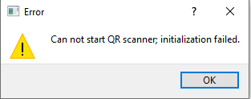
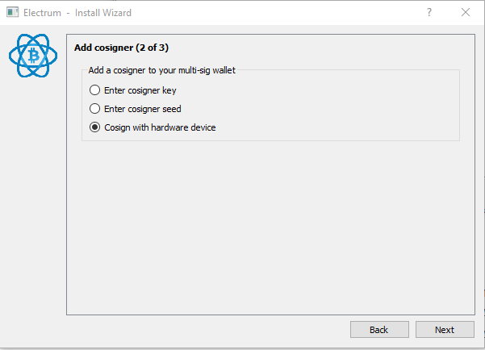
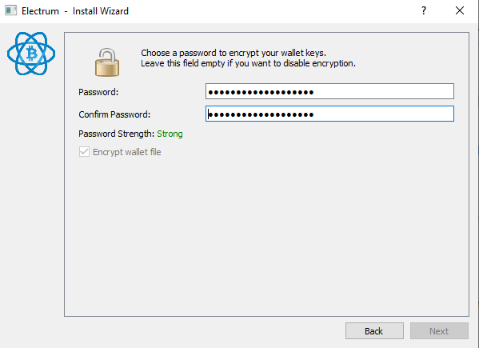

[ [Intro](README.md) ] -- [ [Preparations](raspibolt_10_preparations.md) ] -- [ [The First Keys] ](hodl-guide_20_first-keys.md) -- [ [The Last Key] ](hodl-guide_30_last-key.md) -- [ [**Multi-sig Wallet**] ] -- [ [Bonus](raspibolt_60_bonus.md) ] -- [ [Troubleshooting](raspibolt_70_troubleshooting.md) ]

---

# Create multi-sig wallet with Electrum

We are using Electrum on our main computer to construct the multi-signature wallet.


### Download and verify Electrum

On your main computer (or regular OS) go to https://electrum.org/#download
For our multi-sig to work on both systems, you might need the same version of Electrum as the one used in Tails. But first we need the signing key of Electrum developer Thomas Voegtlin. Scroll down to the bottom of the page and click on the “Public Key” link (you can skip this on Linux and use gpg --import ThomasV.asc):

That should take you to a page with the public key, use `Ctrl+S` and save the file `ThomasV.asc` on your computer.

Go back to https://electrum.org/#download and check what the latest release is. Chanses are that the latest release is newer then the one used in Tails. If that´s the case we need an older release, click “Previous releases”:

That should take you to https://download.electrum.org/. Go to the folder with the same version number as the one in Tails (for example 3.1.3 with Tails 3.12.1). Download the file for your OS (tar.gz for Linux, -setup.exe for Windows and .dmg for macOS) and make sure to download the corresponding .asc file as well. Put the files in the same folder as ThomasV’s signing key:

*Note*, if you´re already using a newer version of Electrum. Downgrading the version might make wallets created with newer versions temporary unusable. Once done with the cold storage, you can upgrade to a newer version of Electrum and everything should work again. Your funds aren´t at risk, you can always recover your funds (or import to an older version) with your recovery seed. 

Once downloaded we need to verify the download in the same way we verified Tails. 
Open a terminal (for example Powershell on Windows).
Change the current directory to the one where the 3 downloaded files are located: 

`$ cd $HOME/Downloads` 

Import the signing key from ThomasV into your local GPG installation: 

`$ gpg --import ThomasV.asc` 

Now use the .asc to check that the Electrum installer was signed with the signing key we imported: 

`$ gpg --verify tails- electrum-3.1.3-setup.exe.asc electrum-3.1.3-setup.exe` (make sure to change the file name on both places if using a newer version). 
The verification can take a while. 

Expected output:
```
gpg: assuming signed data in 'electrum-3.1.3-setup.exe'
gpg: Signature made 04/18/18 17:10:44 W. Europe Daylight Time
gpg:                using RSA key 2BD5824B7F9470E6
gpg: Good signature from "ThomasV <thomasv1@gmx.de>" [unknown]
gpg: WARNING: This key is not certified with a trusted signature!
gpg:          There is no indication that the signature belongs to the owner.
Primary key fingerprint: 6694 D8DE 7BE8 EE56 31BE  D950 2BD5 824B 7F94 70E6
```
The signing was made the same day as the release was uploaded (should be around the same time). 
It´s a `Good signature`. 
A search online on `6694 D8DE 7BE8 EE56 31BE  D950 2BD5 824B 7F94 70E6` seems to verify that this key belongs to Thomas V. We are good to go. Install Electrum and follow the instructions on screen.

### Start creating the multi-sig

Start Electrum. We are going to create a new wallet. If you already have a default Electrum Wallet open, go to `File>New/Restore` (or use Ctrl+N). Otherwise the install wizard should be launched automatically. 

Pick a name for your multi-sig wallet and click Next:

Select "Multi-signature wallet" and hit Next:

Change the first slider to 3 cosigners (with 2 signatures required) and click Next:

Start with the seed you created in Tails. Select “Use a master key”:

Click the QR-code in the bottom right corner:


## Troubleshooting 
If you get the following error:

You’ll probably need to install “Zbar” (or launch it if it’s installed). It’s available at http://zbar.sourceforge.net/ and you can view the source code at https://github.com/ZBar/ZBar. (Only Windows and Linux). It’s generally a good idea to not download random programs from file hosting sites. But Zbar has been around a long time and we can try to ensure it’s a legit copy. If you still don’t want to use Zbar, scroll down to “other solutions”- Otherwise go to https://sourceforge.net/projects/zbar/files/zbar/0.10/. Make sure that “Modified” is 2009-10-XX:

Download the file for your operating system (.exe for Windows and tar.gz or tar.bz2 for Linux). No digital signatures are provided, so we are going to generate the SHA256-checksum of the file. Open a new terminal and change the directory to where the file is located:

`$ cd $HOME/Downloads` 
Generate the checksum:
*on Windows* `> Get-FileHash -a sha256 zbar-0.10-setup.exe`
You should get the following output: 

*on Linux*: 
`$ sha256sum zbar-0.10.tar.gz`
Should produce the output:
`575fa82de699faa7bda2d2ebbe3e1af0a4152ec4d3ad72c0ab6712d7cc9b5dd2  zbar-0.10.tar.gz`
And:
`$ sha256sum zbar-0.10.tar.bz2`
Should produce the output:
`234efb39dbbe5cef4189cc76f37afbe3cfcfb45ae52493bfe8e191318bdbadc6  zbar-0.10.tar.bz2`

It’s the best we can do here and Zbar won’t be handling any critical information. If the hashes match, you know that you’ve got the same file that was used in this guide. If you are okey with that, go ahead and install Zbar and follow the instructions on the screen. Go back to Electrum and click the QR-code, you might have to try 2-3 times before it starts. 

If it still doesn’t start, start the program “zbarcam”, pick a video source, click apply and try in Electrum again:


Scan the QR-code in Electrum. It should read your xpub key and Electrum should automatically show it. 

Other solutions:
If you can’t launch or don’t want to use Zbar, you could use a workaround. 

Option 1 is to simply download another QR-reader on your computer (or check if you have one installed) and scan the QR-code. Copy the scanned result to Electrum. 

Option 2, use a QR-code reader on your smart-phone. Load the photo to the QR-code reader, connect to internet and send the text to your computer with a secure messaging app. 

Option 3, use an online-service like https://webqr.com/index.html. Know that you risk to leak your public key to a third party (which reduces your privacy but isn’t terrible in this case since it’s only 1 of 3 needed keys). Copy the result to Electrum. 

Continuing
We no longer need internet. To reduce the attack vector, put your computer in flight mode.
You should now have a master public key as Cosigner 1, before clicking next take note of a few characters in the beginning, the middle and the end. Click Next:

The next window is a confirmation of your master public key. Make sure it’s the same that the characters you noticed in the previous step and then click Next:

It’s now time to add key 2 (and that's a lot easier). 

Select `Cosign with hardware device`, insert Hardware Wallet A. If it’s a wallet with a physical pin like Ledger, enter the pin (make sure to use the pin that uses password A) and click Next, if you enter the password on the computer, simply click Next:

Electrum should detect your hardware wallet and show its name. If detected, click Next (otherwise, rescan by clicking Next). If using a hardware wallet where the pin is entered on the computer (like Trezor), enter the pin and your password:

It should automatically detect the necessary keys and the next window should be where you add cosigner 3 of 3. Pick “Cosign with hardware device” and click next:

Repeat the procedure you used for key 2 of 3 but with hardware wallet B.

Once done you should be asked for a password to encrypt your wallets keys. This is for your master public keys that’s stored on your computer and it’s a good idea to protect that with a password. Pick a strong password, preferably generated by a password-manager. You can store this password in LastPass, KeepassX or similar managers. Otherwise, type it down on `Info package A`. The password isn’t crucial for your funds, you can always restore your funds with your seed + the seed password. Enter the password and click Next: 

You should now see the following:


Congratulations, your wallet is created! 

If you disconnect your Hardware Wallets, you'll probably get a message like this:

You can simply click `No`

### How to validate and broadcast transactions

As you can see, we are not connected to the internet (and can’t broadcast transactions). This is intentional. Electrum uses servers that’s run by volunteers. Anyone can start a server and if you don’t specify a server, you’ll be connected to one randomly. This is terrible for privacy (and has been used for phishing attacks). If you don’t use tor or a VPN you’re essentially giving a random server your IP-address and the bitcoin addresses you’re asking for. 

**[P]** So, how are we going to verify payments? The best solution right now is to use “Electrum Personal Server” and connect it to your Bitcoin Core node. This can be a little bit tricky for a non-technical user (especially on Windows and Mac). I’ve created a guide for users on Windows in the bonus section, check it out HERE. Linux user can watch a tutorial here https://www.youtube.com/watch?v=1JMP4NZCC5g You can read more about the project on https://github.com/chris-belcher/electrum-personal-server. Once done you can use Electrum as usual, but without relying on someone else for verifying and broadcasting transactions. It’ll also be a perfect setup for your more “day-to-day” spending. You can connect a hardware wallet or use a hot-wallet (private key stored on the computer) and verify all payments yourself. It’s really worth giving it a chance.

**[P]** The second-best option is to use your Bitcoin full node to add watch addresses. If you have a full node running, this is very simple. Check the bonus section for how to add watch addresses in Bitcoin Core HERE. You’d still have to connect to random Electrum servers to transact and your privacy will be reduced. You can save your privacy some by using a VPN. You are then leaking information to your VPN-provider, but at least you know who you put your trust in and limits it to one part. Another option is to look into how you run Electrum with Tor.

The third option is to simply use Electrum as it is. You’re then connecting to random servers. It’s probably safe but you put your trust for validation on third parties. You will be giving all your addresses to remote servers. There are several companies that specialises in chain analysis to deanonymize addresses and we can assume that they’re running several Electrum Servers. So, treat every address that’s gone through a third party as non private.

With this in mind, we are now going to deposit a small amount of funds to our address to make sure our setup works. In the beginning of 2019, transactions are practically free. So, a few $ worth of bitcoin is plenty to try it out. It should cover 3 transaction fees. 

**[P]** Always think twice before depositing funds to your cold storage. If you mess up once, it can destroy the privacy of your whole setup. I highly recommend to properly mix any coins deposited to our cold storage. This is only a test deposit to a one-time address, so mixing is not super important here. But it’s a great time to read up on mixing and start preparing your main stash.
Take a look at the guide in the bonus section for how to mix your coins with Wasabi Wallet.

## Deposit Program

This can be used every time you want to deposit funds to your cold storage.

Open your multi-sig wallet in Electrum and enter the password that unlocks the wallet. Go to Receive and copy the “Receiving address”. 

*Note*, if you used Zbar to setup the wallet, there might be a problem with copy and paste. A restart of Electrum should fix that.

Go to another wallet (like Wasabi Wallet or another Electrum wallet) and send your bitcoin to the receiving address. You should see the unconfirmed balance almost immediately. 

*Optional*: If this is the first time accessing the wallet, you might want to go through the trouble of doing a full restore of your wallet. Do this by disconnecting from the internet, open a wallet in Electrum, go to File>Open (or Ctrl+O). Delete your wallet file. Go back to the first step of the wallet setup process and set it up exactly the same way as you did before (same password etc). When you reconnect to internet, your funds should be there and you can be sure that your process works. 

### Test withdrawal (only needed if this is the frst time depositing to the wallet)

If this is the firs time depositing to the wallet, we’re going to do two test withdrawals. The first one is the most complicated. That procedure is only necessary if you lose one private key and the corresponding hardware wallet. 
Test withdrawal 1
Go to send, enter an address to another wallet you control (like Wasabi Wallet). 
Select around half of the amount you have in the wallet, pick a fee and select “preview”:

In the preview window, select the QR-code in the bottom left corner:


That should bring up the QR-code. Take a photo of the QR-code with your phone. You can close the Transaction dialog.


We are now going back to Tails. So, either go to your second computer or restart your main computer on Tails. We are going to handle a private key, make sure to follow the same procedure that you used when generating the keys (that nothing ore no one can see what you do). In Tails, launch Electrum like before. 

Click next at the first window

We only need the signature, so keep “standard wallet” selected and click Next:

Select “I already have a seed” and click Next:

Enter your 12-word seed on the next screen (again, this is valuable information):

Leave the password field empty (the wallet file will be deleted once finished):

The wallet should now load. Go to `Tools>Load Transaction>From QR code`
Scan the QR code on your phone. 

This should bring up the same Transaction Window that you had on your main OS.
Start by first hitting “Sign”. That should Sign the transaction.
Then click the QR-code:

Take a photo of it with your phone. 

You can now close Electrum and Tails (we won’t be using it anymore). 

Go back to your main computer and open your multi-sig wallet in Electrum. Go to `Tools>Load Transaction>From QR code` and scan the last QR-code. You might have to start Zbar for the camera to work (might be slow to start). 

*Note*, if you are using another way to scan the QR-codes. Scan the QR-code outside of Electrum. In Electrum, go to `Tools>Load Transaction` and paste the text.

That should bring up the transaction window.

Connect one of your hardware wallets and click sign. Follow the instructions on your Hardware Wallet (and control the address)tp sign the transaction. 

If the Hardware Wallet you are using is key 3/3, you’ll probably get a message like this:

Select `No` and wait for Electrum to detect your last Hardware Wallet. Once detected, click `Sign` and follow the instructions on your hardware wallet (this process can be rather slow). Once signed, wait for Electrum to calculate everything. 

Once calculated, click `Broadcast`:

Your transaction should be broadcasted and you’ll probably get a message like this:

Since we are done with Tails, feel free to update to the latest version whenever you like.

The last transfer is much easier. Simply connect your 2 hardware wallets (could connect both at the same time or one at a time). Create an ordinary transaction with the rest of your test amount on the Send tab and hit `Send`:

Sign the transaction (and control the address)on both of your Hardware Wallets.

Before moving on, we need to fill in the last information in the information packages. 

With your wallet open in Electrum, go to `Wallet>Information`. Add the Master Public Key for `cosigner 1` to `info package B`, to `info package E`.

If you use a password manager, in a secure note, add the master public keys from cosigners 1 and 3 to the secure note.

If you don’t use a password manager, add the master public keys from cosigners 1 and 3 to `info package A`.

Delete all the pictures of QR-codes on your phone or camera.


---
Next up: [Store your keys >>](hodl-guide_50_store-keys.md)


