[ [Intro](README.md) ] -- [ [Preparations]( hodl-guide_10_preparations.md) ] -- [ [First Keys](hodl-guide_20_first-keys.md) ] -- [ [Last Key](hodl-guide_30_last-key.md) ] -- [ **Multi-Sig** ] -- [ [Key Storage](hodl-guide_50_key-storage.md
) ] -- [ [Bonus](hodl-guide_60_bonus.md) ] -- [ [Troubleshooting](hodl-guide_70_troubleshooting.md) ]

---

# Create a multi-sig wallet with Electrum

We are using Electrum on our main computer to construct the multi-signature wallet.


## Download and verify Electrum

On your main computer (or regular OS) go to https://electrum.org/#download
For our multi-sig to work on both systems, you might need the same version of Electrum as the one used in Tails. But first, we need the signing key of Electrum developer Thomas Voegtlin. Scroll down to the bottom of the page and click on the “Public Key” link (you can skip this on Linux and use gpg --import ThomasV.asc):


That should take you to a page with the public key, use `Ctrl+S` and save the file `ThomasV.asc` on your computer.

Go back to https://electrum.org/#download and check what the latest release is. Chanses are that the latest release is newer then the one used in Tails. If that´s the case we need an older release, click “Previous releases”:


That should take you to https://download.electrum.org/. Go to the folder with the same version number as the one in Tails (for example 3.1.3 with Tails 3.12.1). Download the file for your OS (tar.gz for Linux, -setup.exe for Windows and .dmg for macOS) and make sure to download the corresponding .asc file as well. Put the files in the same folder as ThomasV’s signing key:

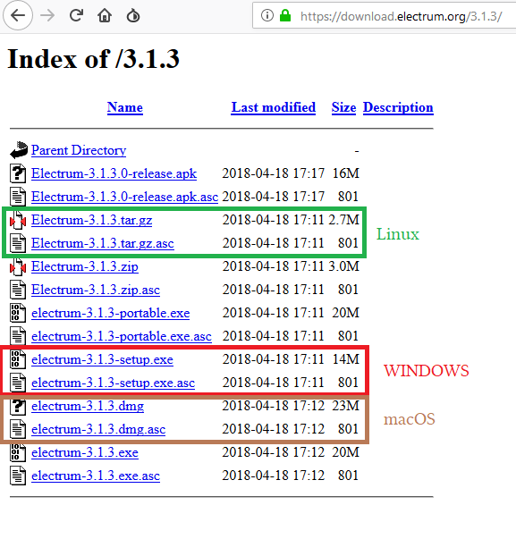

*Note*, if you´re already using a newer version of Electrum. Downgrading the version might make wallets created with newer versions temporary unusable. Once done with the cold storage, you can upgrade to a newer version of Electrum and everything should work again. Your funds aren´t at risk, you can always recover your funds (or import to an older version) with your recovery seed. 

Once downloaded we need to verify the download in the same way we verified Tails. 
Open a terminal (for example Powershell on Windows).
Change the current directory to the one where the 3 downloaded files are located: 

`$ cd $HOME/Downloads` 

Import the signing key from ThomasV into your local GPG installation: 

`$ gpg --import ThomasV.asc` 

Now use the .asc to check that the Electrum installer was signed with the signing key we imported: 

`$ gpg --verify electrum-3.1.3-setup.exe.asc electrum-3.1.3-setup.exe` 
(make sure to change the file name on both places if using a different version). 

The verification can take a while. 

Expected output:
```
gpg: assuming signed data in 'electrum-3.1.3-setup.exe'
gpg: Signature made 04/18/18 17:10:44 W. Europe Daylight Time
gpg:                using RSA key 2BD5824B7F9470E6
gpg: Good signature from "ThomasV <thomasv1@gmx.de>" [unknown]
gpg: WARNING: This key is not certified with a trusted signature!
gpg:          There is no indication that the signature belongs to the owner.
Primary key fingerprint: 6694 D8DE 7BE8 EE56 31BE  D950 2BD5 824B 7F94 70E6
```
The signing was made the same day as the release was uploaded (should be around the same time). 
It´s a `Good signature`. 
A search online on `6694 D8DE 7BE8 EE56 31BE  D950 2BD5 824B 7F94 70E6` seems to verify that this key belongs to Thomas V. We are good to go. Install Electrum and follow the instructions on screen.

### [P] Setup Electrum to run over Tor

Electrum use servers that’s run by volunteers. Anyone can start a server and if you don’t specify a server, you’ll be connected to one randomly. This is terrible for privacy (and has been used for phishing attacks). If you don’t use Tor or a VPN you’re essentially giving a random server your IP-address and all the bitcoin addresses you’re asking for. 

There's several companies that specialises in chain analysis to deanonymize addresses and we can assume that they’re running several Electrum Servers. If you bought your bitcoin on an exchange that use KYC (know your customer), you can assume that your private data will be leaked sooner or later. If you don't do something about it, risk is that almost every transaction you do can be linked to you. A first good step is to use Tor. It uses "onion routing" to hide your true IP-address. You can also use a VPN, both solutions will hide your IP-address from random servers. With a VPN, you'll trust the provider (all traffic go through them) which is probably safe as long as Bitcoin is legal in your jurisdiction (but you never know).

Using Electrum with Tor should be a fairly straightforward process. If you don't have Tor, go to https://www.torproject.org/projects/torbrowser.html and download the latest version of Tor Browser for your OS. You should now know how to verify digital signatures. So download the signature for the file you download as well. You can import the Tor signing key with the command:

`gpg --keyserver pool.sks-keyservers.net --recv-keys 0x4E2C6E8793298290`

Then use:

`gpg --verify {your_file.asc}`

Make sure the output is similar to this:
```
gpg: assuming signed data in 'torbrowser-install-win64-8.0.6_en-US.exe'
gpg: Signature made 02/12/19 14:26:17 W. Europe Standard Time
gpg:                using RSA key EB774491D9FF06E2
gpg: Good signature from "Tor Browser Developers (signing key) <torbrowser@torproject.org>" [unknown]
gpg: WARNING: This key is not certified with a trusted signature!
gpg:          There is no indication that the signature belongs to the owner.
Primary key fingerprint: EF6E 286D DA85 EA2A 4BA7  DE68 4E2C 6E87 9329 8290
     Subkey fingerprint: 1107 75B5 D101 FB36 BC6C  911B EB77 4491 D9FF 06E2
```

When Tor is installed, start Tor. That could be done in two ways. You can launch the browser (it’s much easier to use then a few years ago) or only start Tor (liek tor.exe on WIndows). Only Tor should be located at `.\Tor Browser\Browser\TorBrowser\Tor`. You won't notice anything if you launch Tor without the browser (nothing visible will start).

Start Electrum. If this is the first time you running Electrum, you'll have to create a wallet first (skip these steps and open a wallet if you alreade have one). The wallet you create can be a "dummy" wallet that you delete after the process.

Pick a name for the wallet, click Next:


Let Standard Wallet be selected, click Next:

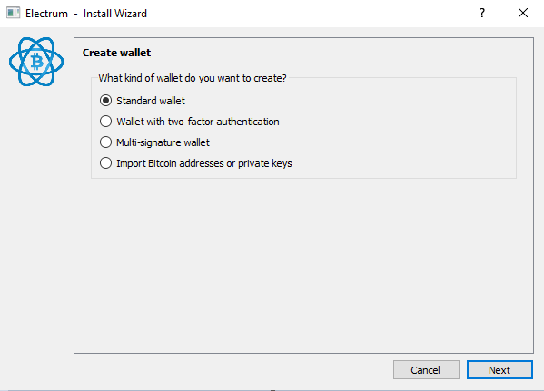

Change to "Use a master key" and click Next:


Since we only want a dummy wallet to access the settings, paste this key in the field and click Next: `xpub661MyMwAqRbcF7NVwdGV5gKTj5cqEwDcJv21g1RqF51YmWj5ycNE4S8Vv3dFZRufGJvbfoFM2hapK6Sd7fdXtyF9QrpKBStMX5LAYJVNWoC`


We don't need a password for this wallet, leave the field blank and click Next:

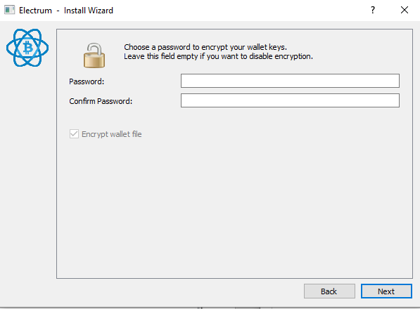

Electrum should now be started. Go to `Tools>Network`. Change the tab to `Proxy`. Select "Use Proxy" and make sure `SOCKS5` is `127.0.0.1` and that the port is `9050`:


The circle in the bottom right corner should change color from green to blue. You have now configured Electrum to run over Tor. Electrum wont connect to anyone unless Tor is running. 

## Create the multi-sig wallet

We are now going to create our multi-sig wallet. If you already have a Electrum Wallet open, go to `File>New/Restore` (or use Ctrl+N). Otherwise start Electrum, the install wizard should be launched automatically. 

Pick a name for your multi-sig wallet and click Next:


Select "Multi-signature wallet" and click Next:


Change the first slider to 3 cosigners (with 2 signatures required) and click Next:


We are now going to construt our multi-sig. Start with `Hardware Wallet A`. If you use a wallet, like Ledger, where the password is written on the device. Make sure the password is active before moving on. Select `Use a hardware device` and click Next:


Electrum should detect your hardware wallet and show its name. If detected, click Next (otherwise, rescan by clicking Next). If using a hardware wallet where the pin and password is entered on the computer (like Trezor), enter the pin and password A:

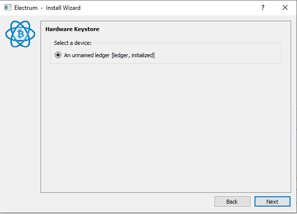

The next window shows your Master Public Key, we will access this later in Electrum and can skip it now, click Next:


We are now going to add key 2. Remove Hardware Wallet A and insert Hardware Wallet B and repeat the process you used for key 1. If it’s a wallet with a physical pin like Ledger, enter the pin (and make sure that it uses `password B`). Select `Cosign with hardware device` and click Next. 

.

Electrum should detect your hardware wallet and show its name. If detected, click Next (otherwise, rescan by clicking Next). If using a hardware wallet where the pin and password is entered on the computer (like Trezor), enter the pin and password B:

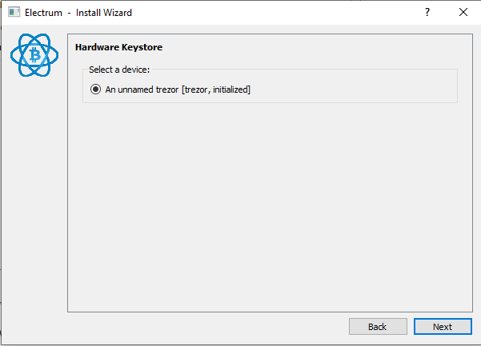

The next window should be where you add cosigner 3 of 3. We are now going to use the key we created with Tails. Select “Enter cosigner key” and click next:

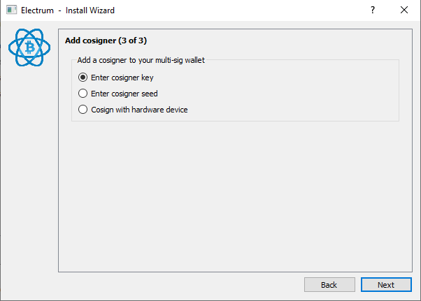


Click the QR-code in the bottom right corner and scan the QR-code on your phone:


That should bring up your `xpub...` key

If you have an error with scanning the QR-code, check the Troubleshooting guide [Scan QR-code with Electrum](hodl-guide_71_scan-QR.md)
  
When the QR-code is in the field, click Next:

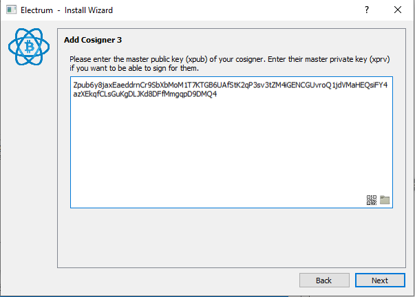

Your wallet is now created and you should be asked for a password to encrypt your wallet. This is for your master public keys that’s stored on your computer and it’s a good idea to protect that with a password. Pick a strong password, preferably generated by a password-manager. You will need this password to open the wallet in Electrum (but not for restoring your funds, you can always restore your funds with your seeds + the seed passwords). You can store this password in LastPass, KeepassX or similar managers or use a password you'll remember. Enter the password, confirm it and click Next: 


You should now see the following:


Congratulations, your wallet is created! 

If you disconnected one, or both, of your Hardware Wallets. You'll probably get a message like this:


You can simply click `No`

## How to validate and broadcast transactions

If you use Electrum over Tor (the circle in the bottom right corner should be blue), you have a pretty solid setup and can use this as it is. Electrum wont connect unless you use Tor and you will hide your real IP-address from any servers. But you still rely on third parties for validation and broadcasting. This is not what a first class Bitcoin citizen do! To verify everything ourselfs, we need to connect Electrum to our Bitcoin Core full node.

**[P]** So, if you run a Bitcoin Core node you can use “Electrum Personal Server” to connect it with Electrum. This can be a little bit tricky for a non-technical user (especially on Windows and Mac). I’ve created guides for users on Windows and Mac in the bonus section. You can find the guides here: [Windows](hodl-guide_63_eps-win.md), [Mac](hodl-guide_64_eps-mac.md). Linux user can watch a tutorial here: https://www.youtube.com/watch?v=1JMP4NZCC5g (not my tutorial) or follow the official documentation. You can read more about the project on https://github.com/chris-belcher/electrum-personal-server. Once done you can use Electrum as usual, but without relying on someone else for verifying and broadcasting transactions. You can use it for more “day-to-day” spending as well. You can connect a hardware wallet to Electrum or use a hot-wallet (private key stored on the computer) and verify all transactions yourself.

**[P]** The second-best option is to use your Bitcoin full node to add watch addresses. You simply add all addresses you want to keep track off and your node checks for any activity on those addresses. If you have a full node running, this is very simple. Check the bonus section for how to [add watch addresses in Bitcoin Core](hodl-guide_65_watch-address.md). You’d still have to connect to random Electrum servers to broadcast transactions, but that isn't terrible if you use Tor or a VPN. The crucial part is to validate every transaction you receive.

Once we have h setup, we are going to deposit a small amount of funds to one of our addresses to make sure everything works. In the beginning of 2019, transactions are practically free. So, a few $ worth of bitcoin is plenty to try it out. The amount should cover 3 transaction fees. 

**[P]** Always think twice before depositing funds to your cold storage. I highly recommend to properly mix any coins deposited to our cold storage (especially if they are from an exchange with KYC). This is only a test deposit to a one-time address, so mixing is not super important here. But it’s a great time to read up on mixing and start preparing your main stash.
Take a look at the guide and best practises in the bonus section for how to [mix your coins with Wasabi Wallet](hodl-guide_62_wasabi-wallet.md). *Note:* Some exchanges treat coins involved in coin join transactions as suspiscous. If you do a coin join transaction and then tries to transfer the coins to an exchange, they might reject your deposit. You have to decide yourself about privacy vs easy of selling. 


## Deposit Program

This can be used every time you want to deposit funds to your cold storage.

Open your multi-sig wallet in Electrum and enter the password that unlocks the wallet. Go to Receive and copy the “Receiving address”. 

*Note:* If you used Zbar to scan your QR-code, there might be a problem with copy and pasting. A restart of Electrum should fix that.

Go to another wallet (like Wasabi Wallet or another Electrum wallet) and send your bitcoin to the receiving address. You should see the unconfirmed balance almost immediately. 

*Optional:* If you want to know that your backup works, you might want to go through the trouble of doing a full restore of your wallet. Do this by disconnecting from the internet, open a wallet in Electrum, go to File>Open (or Ctrl+O). Delete your wallet file. Go back to the first step of the wallet setup process and set it up exactly the same way as you did before (same password etc). When you reconnect to internet, your funds should be there and you can be sure that your process works. 


## Withdrawal program

This can be used when you want to withdraw funds from your cold storage. 

**[P]** If you don't know about coin control and have 100% control of your unspent outputs. Never use funds in your cold storage for day to day spending and don't transfer funds from your cold storage directly to someone that knows your real name or address (like a friend or an exchange). If you connect your real name and/or physical address with addresses in your cold storage, that could be used to "cluster" addresses togheter and reveal what addresses you control. A good rule of thumb is to use Wasabi Wallet, or a similiar service, to mix all funds going into cold storage and all funds going out of cold storage. *Note:* Like said before, some exchanges might treat bitcoins involved in coin join transactions as suspiscous. 

If this is the firs time depositing to the wallet, we’re going to do two test withdrawals. The first one use your two hardware wallets and should be fairly easy. The second one is with your third backup key. That procedure is only necessary if you lose one private key or its password and the corresponding hardware wallet. Normally, use the method described in "Withdrawal method 1". 

#### Withdrawal method 1

Open your wallet in Electrum. Connect your 2 hardware wallets. You can connect both at the same time or one at a time. If you use them one at a time, start with Hardware Wallet A. On the Send tab, create an ordinary transaction with half of your test amount to an address you control (like an address in Wasabi Wallet or in another Electrum Wallet). Once the transaction is constructed click `Send`:


Sign and confirm the transaction with one Hardware Wallet at the time, start with Hardware Wallet A. If your hardware wallet has a screen, control the information (like address and amount) on the screen.


#### Withdrawal method 2

This is the backup method and should only be needed in case you lose some of your keys. But it's a good check to make sure our third key was works.

In Electrum, go to send, enter an address to another wallet you control. 
Select the rest of the test amount you have left in the wallet, pick a fee and select “preview”:

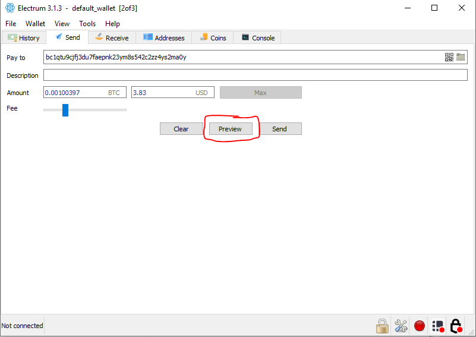

In the preview window, select the QR-code in the bottom left corner:


That should bring up the QR-code. Take a photo of the QR-code with your phone. You can close the Transaction dialog.

We are now going back to Tails. So, either go to your second computer or restart your main computer on Tails. We are going to handle a private key, make sure to follow the same procedure that you used when generating the keys (that nothing ore no one can see what you do). In Tails, launch Electrum like before. If you already have Electrum running create a new wallet by going to `File>New/Restore` (we are going to create the exact same wallet as before as a check that our seed works).

Click next at the first window:


We only need the signature, so keep “standard wallet” selected and click Next:


Select “I already have a seed” and click Next:

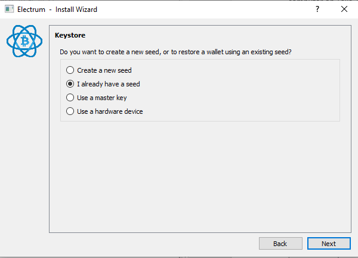

Enter your 12-word seed on the next screen (again, this is valuable information):

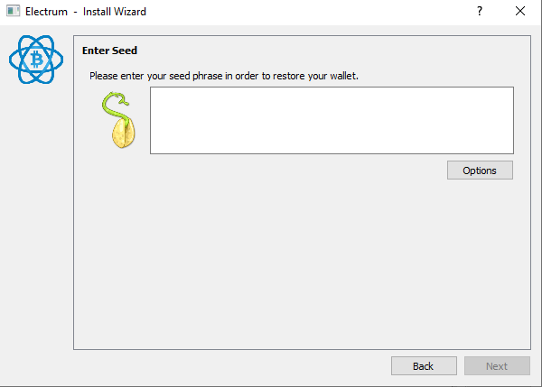

Leave the password field empty (the wallet file will be deleted once finished):


The wallet should now load. Go to `Tools>Load Transaction>From QR code`
Scan the QR code on your phone. 

This should bring up the same Transaction Window that you had on your main OS. If you get an error, check that the Electrum version is the same in Tails as on your main computer.

Start by first clicking “Sign”. That should Sign the transaction.
Then click the QR-code:

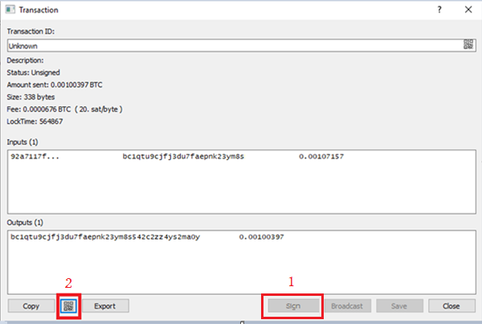

Take a photo of the QR-code with your phone. 

You can now close Electrum and Tails (we won’t be using it anymore). Remove the Tails USB from the computer to delete all information.

Go back to your main computer and open your multi-sig wallet in Electrum. Go to `Tools>Load Transaction>From QR code` and scan the last QR-code. You might have to start Zbar and select a camera for the camera to work (and it might be slow to start, so try 2-3 times). 

*Note*, if you are using another way to scan the QR-codes. Scan the QR-code outside of Electrum. In Electrum, go to `Tools>Load Transaction` and paste the text.

That should bring up the transaction window.

Connect one of your hardware wallets and click sign. Follow the instructions on your Hardware Wallet, control the address and the amount, and sign the transaction. 

If you are using Hardware Wallet B to sign, you’ll probably get a message like this:


Select `No` and wait for Electrum to detect Hardware Wallet B. Once detected, click `Sign` and follow the instructions on your Hardware Wallet (this process can be rather slow). Once signed, wait for Electrum to calculate everything. 

Once calculated, click `Broadcast`:


Your transaction should be broadcasted and you’ll probably get a message like this:

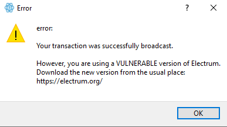

Since we are done with Tails, feel free to update to the latest version whenever you like.

## Update information packages

Before moving on, we need to fill in the last information in the information packages. 

With your wallet open in Electrum, go to `Wallet>Information`. 

In your `secure note` add all master public keys, like this:
```
MPK1: xpub668...
MPK2: xpub78e...
MPK3: xpub87t...
```
In `information package A` add the master public key from cosigner 3:

`MPK1: xpub668...`

In `information package C` add the master public key from cosigner 2:

`MPK2: xpub78e...`

Thats it! Finish by deleting all the pictures of QR-codes on your phone or camera.

---

Next up: [Key storage >>](hodl-guide_50_key-storage.md)
