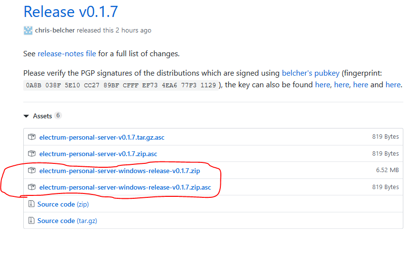
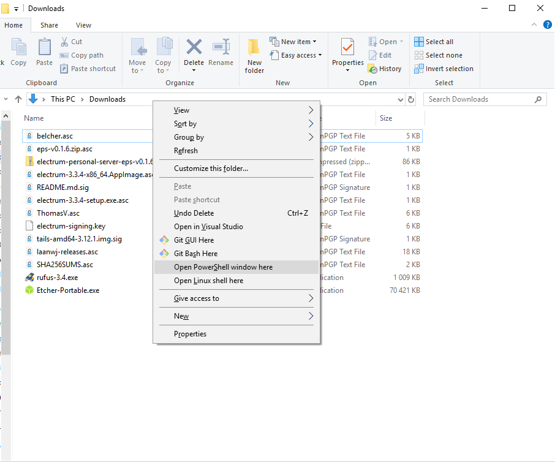
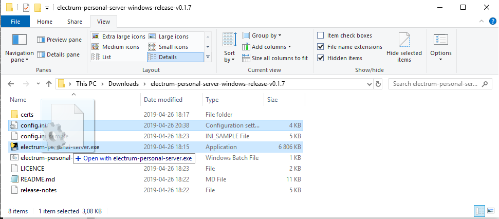
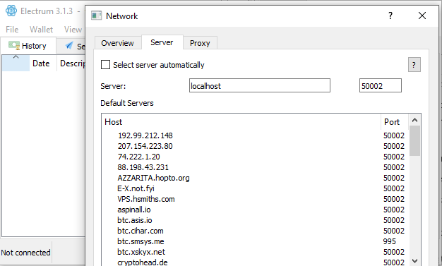
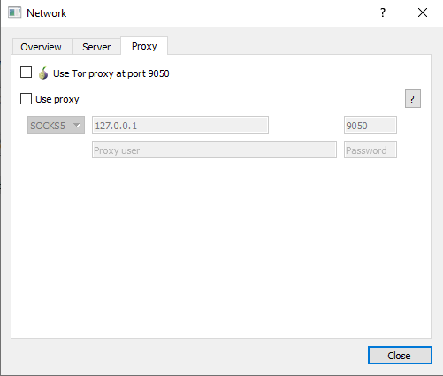
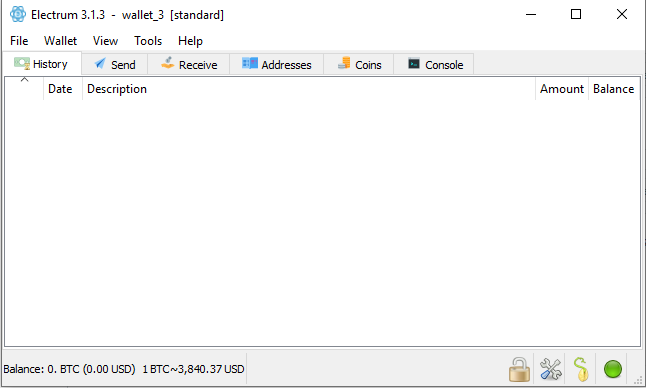
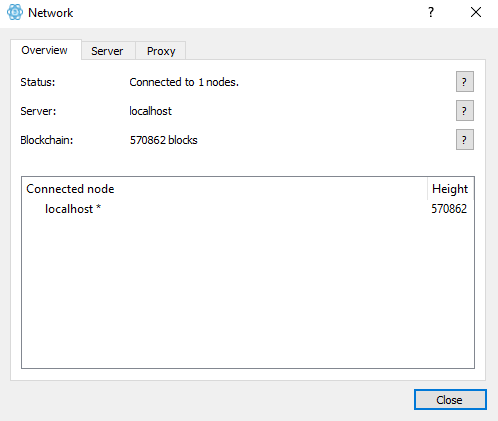

[ [Intro](README.md) ] -- [ [Preparations]( hodl-guide_10_preparations.md) ] -- [ [First Seeds](hodl-guide_20_first-seeds.md) ] -- [ [Last Seed](hodl-guide_30_last-seed.md) ] -- [ [Multi-Sig](hodl-guide_40_multi-sig.md) ] -- [ [Storage](hodl-guide_50_storage.md
) ] -- [ **Bonus** ] -- [ [Troubleshooting](hodl-guide_70_troubleshooting.md) ]

---

# Electrum Personal Server on Windows 10

*Difficulty: easy*

Electrum Personal Server will connect your Bitcoin full node to Electrum. This will make it possible to use all functionality in Electrum (Hardware Wallet support, easy multi-sig setup and more) while still validating and broadcasting everything with your full node.

If you like to know more about the project, go to https://github.com/chris-belcher/electrum-personal-server and read the intro (before How To).

Before starting, make sure you’ve got a Bitcoin Core full node running and synced. If don’t, see [Install and optimize Bitcoin Core](hodl-guide_61_bitcoin-core.md).

You also need [Electrum](https://electrum.org/#download). Always check the digital signatures before installing, more info on how [here](https://github.com/DriftwoodPalace/guides/blob/master/hodl-guide/hodl-guide_30_last-seed.md#download-and-verify-electrum).

If you have any issues during the setup, check out the troubleshooting section at [the end](https://github.com/DriftwoodPalace/guides/blob/master/hodl-guide/hodl-guide_63_eps-win.md#troubleshooting) of this guide.

## Download files

Before installing anything we need to verify the download. To do this we need the developer, Chris Belchers, signing-keys. It can be found [here](https://github.com/chris-belcher/electrum-personal-server/blob/master/pgp/pubkeys/belcher.asc).

On the page, click “raw”:


Use `Ctrl+S` and save the key in a folder on your computer (preferably in the folder you download files to).

Then, navigate to the [release page](https://github.com/chris-belcher/electrum-personal-server/releases) and download the latest release for Windows. Make sure to download the corresponding `.asc` file (detached signature) as well. For example:



To verify everything, we need Gpg4win. If it’s not already installed, go to https://www.gpg4win.org and install the latest release for Windows. If you don’t want to donate, click bank transfer on the download page to access the download. You only need to install GnuPG and Kleopatra. Start Kleopatra once finished.

Then, navigate to the folder where the downloaded files are located. Use `Shift+Right Click` to bring up a menu. In the menu, select "Open PowerShell window here". For example, if your files are located in "Downloads":



That should automatically start PowerShell in the correct directory (else start PowerShell manually and use `cd ~\downloads` to change to the right directory)

Start by importing Belchers signing key to your local directory by typing this in PowerShell:

`gpg --import belcher.asc`

Then verify the zip-file:

` gpg --verify electrum-personal-server-windows-release-v0.1.7.zip.asc`

The output should be something similar to this:

```
gpg: assuming signed data in 'electrum-personal-server-windows-release-v0.1.7.zip'
gpg: Signature made 04/26/19 18:26:08 W. Europe Daylight Time
gpg:                using RSA key EF734EA677F31129
gpg: Good signature from "Chris Belcher <false@email.com>" [unknown]
gpg: WARNING: This key is not certified with a trusted signature!
gpg:          There is no indication that the signature belongs to the owner.
Primary key fingerprint: 0A8B 038F 5E10 CC27 89BF  CFFF EF73 4EA6 77F3 1129
```

We can see that the signature was made at a date close to the release, it's a `Good signature` and the Primary key fingerprint is the same as on Github. We can double check by doing a search online on the fingerprint. That confirms from various sources that the key seems to belong to Chris Belcher. If you get a different fingerprint or a bad signature, stop and investigate further.

Otherwise go ahead an unzip the .zip file to any location on your computer.

## Modify the config-file

We need to modify a few settings before starting the server.

Navigate to the unzipped folder `\electrum-personal-server-windows-release-v0.1.7` and make a copy of the file `config.ini_sample` and rename the copy to `config.ini` (you’ll get a warning about changing the file name extension, select Yes).

*Note:* Make sure that you can see file extensions, it can be changed at “View” in the top-bar:


Right click on `config.ini` and select edit to edit it with a text editor (notepad etc).

### For multi-sig wallets

To import a multi-sig wallet, open the wallet in Electrum. Go to `Wallet>Information` and copy the Master Public Key for cosigner 1.

In `config.ini`, create a new line and give the wallet a name. If you are using a 2 of 3 multi-sig, type `2` (required-signatures) after the name. Then paste cosigner 1s key. Go back to Electrum, copy the key for cosigner 2 and paste it after cosigner 1s key (on the same row) and go back to Electrum and copy and paste the key for cosigner 3. Your row should look like this (but with your 3 keys):

```
my_multisig_wallet = 2 xpub661MyMwA... xpub6AMQ6ZPNa6... xpub6A2po6ffdf...
```

You can change the name “my_multisig_wallet” if you like. Make sure that you don't have the symbol `#` in front of the line (it'll then be treated as a comment).

*Note:* This is storing your master public keys in cleartext on your computer. A malicious actor could get hold of this and from that derive all of your bitcoin addresses (your funds are not at risk because of this).

### Single wallet

If you want to add a single wallet, for example with one key from a hardware wallet. Follow the same procedure. Open the wallet in Electrum and go to Wallet>Information and copy the Master Public Key. Pick a name and paste the key in `config.ini` file.
For example:

```
Hw_wallet1 = xpubkg4QUp5XpUdNf2uGXvQmnD4zcofZ1MN6Fo8PjqQ…
```

### Rest of the config.ini file

If you’ve moved your Bitcoin data directory (where your blocks and chainstate are stored) you need to add that directory to the line `datadir` (you might need to add this even if you use the default location, default locations can be found here https://en.bitcoin.it/wiki/Data_directory). For example:

```
datadir = D:\Bitcoin
```

You can use the default RPC-verification for Bitcoin Core. In that case Bitcoin Core creates a cookie file for you and you don't have to add anything else to config.ini. If you don't know what this is, you're probably using the default setting and can save and close the file.

Another alternative is to use a `rpcuser` and a strong (many random characters) `rpcpassword` with Bitcoin Core. This can be necessary for applications like the lightning network to work. If you are using this you'll need to add this to `config.ini` as well. Uncomment (remove `#`) the two lines `rpc_user` and `rpc_password` and add your information. If you don't have a user and a password for Bitcoin Core yet, you can create that here and transfer it to Bitcoin Core later.

## Settings in Bitcoin Core

To get Electrum Personal Server to connect to Bitcoin Core, you might need to change a few settings in Bitcoin Core. This is done in the configuration file for Bitcoin Core.

If you're unsure if you have a configuration file or not, open Bitcoin Core and go to `Settings>Options` and select `Open Configuration File` on the main tab. That should either create a new file in the right directory or open your existing file.

Add:

```
server=1
```
to a new line (this'll turn on the RPC-server).

If you use a rpcuser and rpcpassword add this to new lines as well. The file should in that case look like this:

```
server =1
rpcuser=your_user
rpcpassword=your_password
```

The wallet in Bitcoin Core needs to be enabled. So, make sure that `disablewallet` is not present in the configuration file. Save and close the file. For the settings to have effect, you need to restart Bitcoin Core.

## Import addresses to the server

Both of your configuration files should now be in order and we can start the server. Go back to the folder `electrum-personal-server-windows-release-v0.1.7`. To start the server drag the file `config.ini` onto the file `electrum-personal-server.exe`:



The first time the server is run it will import all configured addresses as watch-only into the Bitcoin node, and then exit. If your wallet contains old transactions, you'll need to rescan the local copy of the blockchain for any transactions in your wallet. 

Do this by dragging `config.ini` onto the batch script `electrum-personal-server-rescan.bat`. That should open a command prompt where you'll be asked for a date to rescan from. Enter a date (in the format DD/MM/YYYY) from where you would like to start importing addresses (the further back, the longer time it will take) and hit return. You'll get a suggestion of a block height to start from. Type `y` and hit return. Wait for the rescanning to finish (the server will exit once finished).

If you don't rescan and open an old wallet, the balance will show 0 as it doesn't know about any old transactions (you can always do a rescan later to see the transactions).

Now you can start the server "for real". 

*Optional*: Create a shortcut so you don't have to drag the config.ini file onto the .exe file all the time. Do this by right clicking on `electrum-personal-server.exe` and select `Create shortcut`. Right click on the shortcut and select properties. In the `Target` field, paste the full path to config.ini after the path to `electrum-personal-server.exe`. So that the full line reads something like:

```
C:\Users\{user}\Downloads\electrum-personal-server-windows-release-v0.1.7\electrum-personal-server.exe "C:\Users\{user}\Downloads\electrum-personal-server-windows-release-v0.1.7\config.ini"
```

You can place this shortcut anywhere you like and use it to start the server.

So go ahead and use your shortcut or drag `config.ini` onto `electrum-personal-server.exe` to start the server. Wait for this message to appear:

```
Listening for Electrum Wallet ...
```

## Setting up Electrum

Now we only need to tell Electrum to listen to our server!

Start Electrum and open a wallet. Go to `Tools>Network`.

Uncheck "Select server automatically" and change `Server` to `localhost`:



(if you changed port `50002` in `config.ini` make sure to change to the same port here, otherwise use the default.)

If you use Electrum over Tor you have to disable this (no need to connect to your own server over Tor). Change tab to "Proxy" and uncheck "Use Tor proxy at port 9050":



Close the dialog once finished. Electrum should now be connected to your full node!

You can confirm this by looking for the green circle in the bottom right corner of Electrum and the message `Electrum connected from ('127.0.0.1', 60449)` on the server side.

It's still a good idea to use Tor, but you'll have to do it with your Bitcoin Core node now. Check out the guide for [running Bitcoin Core over Tor](https://github.com/DriftwoodPalace/guides/blob/master/hodl-guide/hodl-guide_61_bitcoin-core.md#running-bitcoin-core-over-tor)

### Disable connections to other servers

*Pro tip:* Create a shortcut that disables all connections to other servers (otherwise, Electrum will still download block headers from other servers). With this shortcut you don’t risk connecting to a public server by mistake. If you don’t have a shortcut to Electrum on your desktop or in a folder. Navigate to the folder where Electrum is located, standard is `"C:\Program Files (x86)\Electrum"`. Right click on the `.exe` file, for example `electrum-3.1.3.exe`. Select Create Shortcut. You’ll get the following message:


Select Yes

Navigate to the desktop and right click on the shortcut. Select `properties`. In `Target` add the following to the end of the line:

`--oneserver --server localhost:50002:s`

So, the whole line reads something like:

`"C:\Program Files (x86)\Electrum\electrum-3.1.3.exe" --oneserver --server localhost:50002:s`

If you’ve changed the port from `50002` in `config.ini`, make sure to change to the same port here. Use the shortcut to start Electrum (and make sure to only use this shortcut to start it).

Your wallet should be connected to your bitcoin full node (the circle in the bottom right corner should be green)!



You can verify that only your server is being used by going to `Tools>Network`. You should only see localhost at overview:



If you change tab to "Server". Localhost should be selected and everything should be greyed out (not possible to change anything).

## Troubleshooting

If the terminal `cmd.exe` starts and quickly exits the server isn’t starting properly. Check the log file for errors. The log file is located in `C:\Users\{user}\AppData\Local\Temp\electrumpersonalserver.log`.

You can open it by typing `ii ~\AppData\Local\Temp\electrumpersonalserver.log` in PowerShell or navigate to it manually.
 
If you see an error message like:

```
WARNING:2019-02-27 09:32:22,102: Unable to find .cookie file, try setting `datadir` config
```

Check the `datadir` in your config.ini file and make sure that you have `server=1`in the configuration file for Bitcoin Core.

If the server starts but you get a `JSON-error`, your rpc_user and/or rpc_password is probably wrong. Check your configuration files and check so you don't have multiple config files (in the default location and in the new location if you moved the installation). You can check which file Bitcoin Core is using by going to Settings>Options and then Open Configuration File in Bitcoin Core.

You can also try to change the authentication method if you can't resolve it. If you use rpcuser and rpcpassword try the cookie method or the other way around.

Below is a copy of a `config.ini`-file with a 2 of 3 multi-sig wallet where the datadir is changed to D:\Bitcoin. It uses `rpcuser` and `rpcpassword` in `bitcoin.conf` (All comments `#` in this file is removed for readability, can be a good idea to keep those)

```
[master-public-keys]
my_multisig_wallet = 2 xpub661MyMwAqRbcEYS8w7XLSVeEsBXy79zSzH1J8vCdxAZningWLdN3zgtU6LBpB85b3D2yc8sfvZU521AAwdZafEz7mnzBBsz4wKY5e4cp9LB xpub127pc4e5YKw4zsBBznm7zEfaZdwAA125UZvfs8cy2D3b58BpBL6Utgz3NdLWgninZAxdCv8J1HzSz97yXBsEeVSLX7w8SYEcbRqAwMyM9LB xpub7g5pc4e5YKwBL9MyMwAqRbcEYS8w7XLSVeEsBXy79zSzH1J8vCdxAZningWLdN3zgtU6LBpB85b3D2yc8sfvZU521AAwdZafEz7mnzBBsz4wKY5e4cp9LB
[watch-only-addresses]

[bitcoin-rpc]
host = 127.0.0.1
port = 8332
datadir = D:\Bitcoin
rpc_user = user
rpc_password = password

wallet_filename =
poll_interval_listening = 30
poll_interval_connected = 5
initial_import_count = 1000
gap_limit = 25

[electrum-server]
host = 127.0.0.1 
port = 50002
ip_whitelist = *
certfile = certs/cert.crt
keyfile = certs/cert.key
```

And what needs to be in `bitcoin.conf` (you can have other settings as well, this is what’s important for Electrum personal server):

```
server=1
rpcuser=user
rpcpassword=password
```

You need to restart Bitcoin Core for changes in `bitcoin.conf` to have effect.

If you get the following error:

```
OSError: [WinError 10013] An attempt was made to access a socket in a way forbidden by its access permissions
```

The risk is that some other service is using a port you are trying to connect to.
Try another port for electrum server by changing the port for "electrum-server" in `config.ini` file like:

```
[electrum-server]
host = 127.0.0.1
port = 8000
```

Use a port with lower number then 40 000. Risk is that a higher port can be used by another service.

---

<< Back: [Bonus guides](hodl-guide_60_bonus.md)
