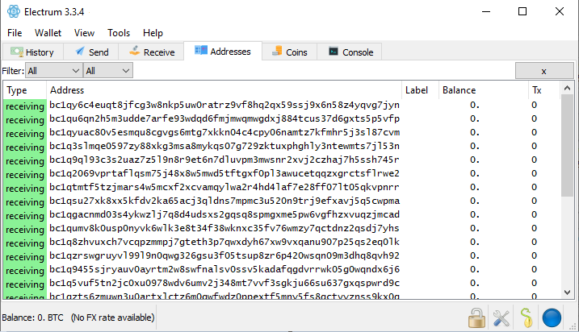
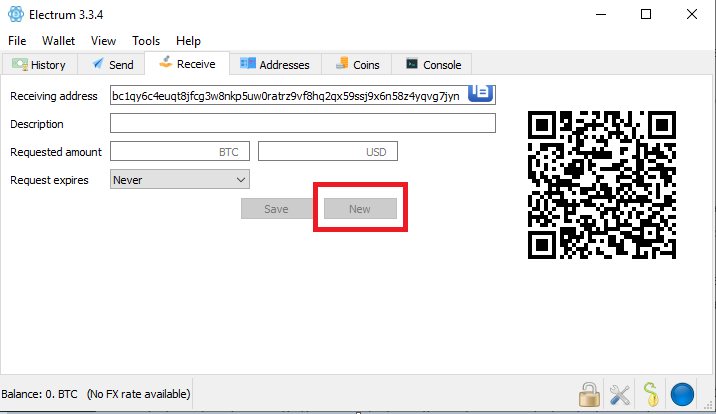
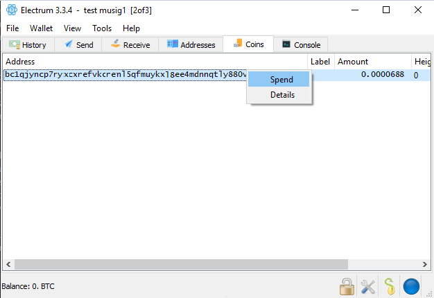

[ [Intro](README.md) ] -- [ [Preparations]( hodl-guide_10_preparations.md) ] -- [ [First Seeds](hodl-guide_20_first-seeds.md) ] -- [ [Last Seed](hodl-guide_30_last-seed.md) ] -- [ [Multi-Sig](hodl-guide_40_multi-sig.md) ] -- [ [Storage](hodl-guide_50_storage.md
) ] -- [ **Bonus** ] -- [ [Troubleshooting](hodl-guide_70_troubleshooting.md) ]

---

## Electrum best practises

*Difficulty: medium*

Compared to the traditional financial system, simply using Bitcoin and controlling your own keys is a big step forward from a privacy standpoint. But this can be improved even more by thinking about a few key points.

Privacy isn't black or white. It's a scale where every privacy leak can be used against you (the more leaks the worse). All bitcoin transactions are public so you can leave traces on chain. You can also leave traces off chain. For example when you broadcast transactions or use your real name to purchase things with bitcoin.

How much effort you put in to protect your privacy depends on your personal threat level and how much bitcoin you protect. How much time and effort is it worth to put in to secure your bitcoin the best you can?

If you have taken the time to create a cold storage wallet, I would advise you to at least look at some of the easiest solutions that'll give you most "bang for your bucks".

### Short version

* Use Wasabi Wallet as a spending wallet and never use your cold storage wallet to directly send funds to someone else. Or use the lightning network (mix funds with Wasabi before depositing to your lightning wallet).
* Mix all bitcoins with Wasabi Wallet or Joinmarket before depositing to your cold storage.
* Never reuse any old addresses.
* "Top up" your spending wallet with whole UTXOs (coins). Do not produce any change in your cold storage wallet.
* If you don't have Electrum connected to your own full node, mix all coins going out of your cold storage wallet.
* [Setup Electrum to run over Tor](hodl-guide_66_electrum-tor.md). Or even better connect it to your full node with Electrum Personal Server (guide for [Windows](hodl-guide_63_eps-win.md) and [Mac](hodl-guide_64_eps-mac.md) and have it running over Tor.
* Do not look up your addresses on any block explorers.

A solid setup would be:

`Electrum multi-sig wallet > Electrum Client > Electrum Personal Server > Bitcoin Core > Tor`

### Long version

Create a separate spending wallet so you have at least one spending wallet and one cold storage wallet.

#### Wasabi Wallet

I would recommend [Wasabi Wallet](https://www.wasabiwallet.io/) ([Tor link](http://wasabiukrxmkdgve5kynjztuovbg43uxcbcxn6y2okcrsg7gb6jdmbad.onion/)) as a spending wallet . Wasabi Wallet is designed to be a spending wallet. A bitcoin is only an unspent output from a previous transaction (UTXO). Wasabi gives you control of these outputs. It also offers an excellent option to mix your coins with coin join. You can find a guide with more information [Here](hodl-guide_62_wasabi-wallet.md).

#### Mix all deposits

When you spend bitcoin, you usually link different UTXOs together to construct the payment and then send some of it back to yourself as change. If you aren't careful, this can be used to cluster many addresses in your wallet together. It's not fool proof, but someone watching the block chain could assume that a cluster of addresses belongs to you. If you then use one address in the cluster to example buy something and ship it to your home or deposit bitcoin to an exchange that use KYC. Many more addresses can be linked to you.

This heuristic can be broken if you use coinjoin. One method is to use Wasabi Wallet (or Joinmarket) to mix all your coins before depositing to cold storage. Then it doesn't really matter what you've done with the coins before. It can be a good idea to keep a few mixed outputs in Wasabi Wallet and use that if you'd like to spend bitcoin. Remember that Wasabi Wallet is a hot wallet. Treat it like cash in your pocket and don't keep larger amounts in it. Then you can top up your Wasabi Wallet as needed. Either by buying more at an exchange (and mix) or depositing from your cold storage. You can find a few [best practises for Wasabi Wallet](hodl-guide_62_wasabi-wallet.md) in the bonus section.

#### Never reuse old addresses

Reusing old addresses could be terrible for privacy. Some cold storage solutions only use one address. It only takes one deposit or one withdrawal where you reveal yourself to make an educated guess that you control all funds on that address. For example too or from an exchange that use KYC. All the exchange needs to do is to look at the block chain and look where the funds originated from.

Electrum generally gives you a fresh address automatically. But it can sometimes lag if you deposit funds close to each other. So, always check the "Transaction tab" first. Look at the last transaction that received any funds (Tx greater then 0) and then at the address below that (Tx = 0):

 Then go to the "Receive tab" and make sure that it's the address with 0 transactions. If it's an old address. Click "New":

In our example it's the first address in a new wallet. So it would be OK to deposit funds here.

#### Withdraw whole UTXOs

Always try to withdraw whole outputs from your cold wallet. This way, you won't produce any change that you have to keep track of. Change can, like reuse of addresses, be used to cluster different addresses together. This increases the amount of addresses that can be linked to you in case of a privacy breach somewhere. This is easier if you 

To get control of this in Electrum, go to the `Coins` tab. If you don't see the tab, go to `View>Show Coins`. You should see all your different addresses.

Right click on the address ("coin") you'd like to spend from. Select `Spend`:

That should take you to the "Send tab". Fill in the receiving address and select "Max" on the `Send` tab (if you like to spend the whole output). You can send more then one output in the same transaction, but know that they'll be linked together. If you'd like to do this, go back to the "Coins tab". Select multiple outputs by holding ctrl/cmd and mark the outputs. Then right click and select "Spend".

#### Mix everything going out of cold storage

If you don't run your own full node and connect Electrum to it with for example Electrum Personal Server, you should mix everything going out of your wallet. That's the case even if you mixed everything before depositing to the wallet. Electrum uses specialised servers that will know of all your used addresses. Anyone can run a server and you'll be connected to one randomly by default.

Even if you use Tor you are still giving all your addresses to some random server. Tor will hide your real IP, but the server will still know which addresses belongs together. If you say, transfer one whole UTXO to Wasabi but doesn't mix. At a later date you deposit this output to an exchange that knows your name. The exchange probably collaborates with some company that analyses the blockchain to prevent "money laundering" or something. This company probably runs one, or several, Electrum servers that you might have been connected to.

It's then trivial to track your deposit back to your wallet. They can make an educated guess that you control your whole wallet balance and you do not know who they'll sell or give this information to. If you don't use Tor (or a VPN), this will be even easier. The server has your IP-address (connected to all your addresses) and the exchange can see that you log in with the same IP on their site.

If you mix your coins before depositing on the exchange, it'll be much much harder to trace it back to your wallet. It'll be like a firewall that protects your cold storage. If someone tries to trace the coins, they'll probably get stuck on an transaction with maybe 50 different options on where the funds might have originated from. This will be more effective if you use Tor or a VPN (Tor is better as you will constantly change your IP-address), otherwise your IP-address is still linked to your wallet.

That's why the next recommendation is to configure Electrum to run over Tor. You can find a guide for that [here](hodl-guide_66_electrum-tor.md). That's only if you can't run a full node and connect Electrum to that. With a full node you will download every transaction and every block. No one can know what transactions you are looking for (something that's always going to be a problem with "light wallets"). You are running the server that's controlling all the information.

You can find a guide for setting up Bitcoin Core, [here](hodl-guide_61_bitcoin-core.md). For connecting your full node to Electrum with Electrum Personal server, you can find a guide for Windows [here](hodl-guide_63_eps-win.md) and for Mac [here](hodl-guide_64_eps-mac.md).

If you use your full node (especially if it use Tor), there really isn't any need to mix your coins when withdrawing. As long as you avoid producing change and always send whole UTXOs out of your wallet. Unless someone has your master public key, it should be very hard to cluster the addresses in your wallet together. However, if fees are low and you have the time, there's no harm in mixing again to be safe.

#### Do not look up your addresses on block explorers

Last but not least. Do not go and look up any of your addresses on a block explorer. You will destroy a lot of the hard work you put in. Who else then you would go to a block explorer and look up one of your addresses? Maybe multiple times or right after a transaction with a few updates until the transaction is confirmed.

If you do this with your real IP-address, it's a clear indication that the address belongs to you and this could be saved somewhere and later used to deanonymize you. If you really need to look it up for some reason, use the Tor browser. The block explorer will then know that someone looked up an address. But it can't know who. You could for example use blockstream.info with their [.onion address](http://explorerzydxu5ecjrkwceayqybizmpjjznk5izmitf2modhcusuqlid.onion/).

---

<< Back: [Bonus guides](hodl-guide_60_bonus.md) 
